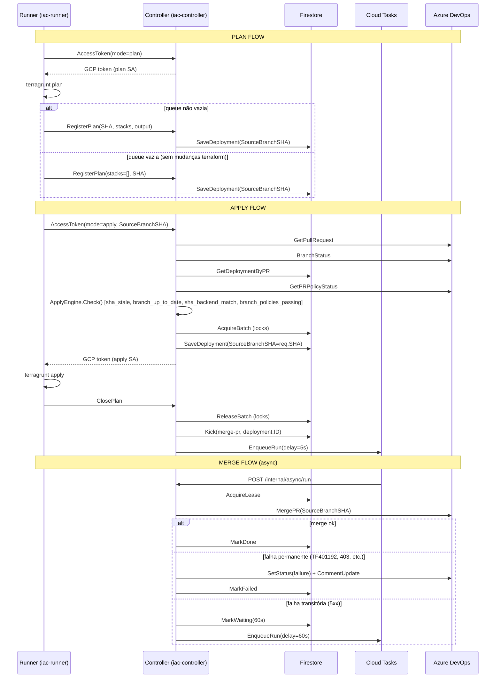
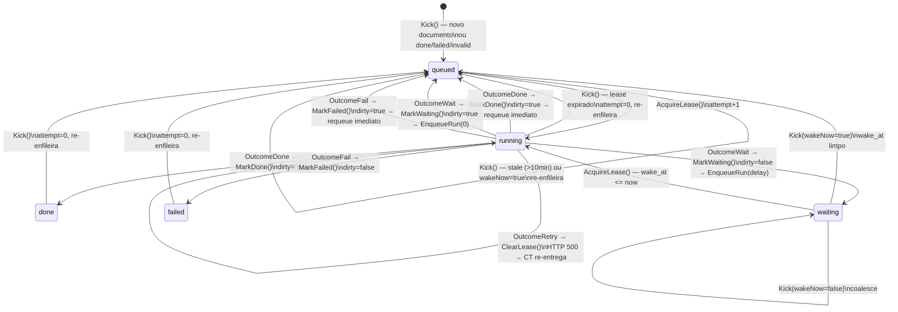

# Async Engine — State Machine

## Visão Geral do Fluxo Completo



---

## Diagrama de Estados



---

## Arquitetura do Engine

### Invariantes

1. **Dirty check atômico**: cada `Mark*` checa o flag `dirty` na mesma transação Firestore que escreve o novo estado. Não há janela de race entre a transição e a verificação.

2. **Retry preserva o lease limpo**: `OutcomeRetry` chama `ClearLease` antes de retornar HTTP 500, permitindo que Cloud Tasks re-entregue imediatamente sem esperar o TTL expirar.

3. **Estados terminais são idempotentes**: `AcquireLease` rejeita `done`/`failed` — re-entregas tardias do Cloud Tasks são no-ops.

4. **wait_at é respeitado**: `AcquireLease` rejeita aquisição se `status=waiting` e `wake_at > now`.

5. **OutcomeWait com dirty não desperdiça mensagem**: se dirty=true durante `MarkWaiting`, o engine enfileira com `delay=0` (sem enfileirar o delay original).

### Interface Store (7 métodos)

```
UpsertQueued    — cria ou atualiza para queued; retorna se deve enfileirar
AcquireLease    — adquire lease atômico; recusa terminais e waiting precoce
Get             — leitura simples para observabilidade
MarkDone        — transição done (ou queued se dirty); retorna requeue bool
MarkWaiting     — transição waiting (ou queued se dirty); retorna requeue bool
MarkFailed      — transição failed (ou queued se dirty); retorna requeue bool
ClearLease      — zera lease sem alterar status (usado por OutcomeRetry)
```

### Fluxo de RunOnce

```
AcquireLease → not acquired → HTTP 200 (no-op)
             → acquired
                 ↓
             registry.Get → not found → MarkFailed("no handler") → HTTP 200
                          → found
                              ↓
                          h.Run(ctx, exec) → runErr → HTTP 500
                                           → outcome
                                               ↓
                          OutcomeRetry → ClearLease → HTTP 500
                          OutcomeDone  → MarkDone(checkpoint)  → requeue? EnqueueRun(0)
                          OutcomeWait  → MarkWaiting(wakeAt)   → requeue? EnqueueRun(0)
                                                                        : EnqueueRun(delay)
                          OutcomeFail  → MarkFailed(err)       → requeue? EnqueueRun(0)
                          default      → MarkFailed("unknown") → requeue? EnqueueRun(0)
                              ↓
                          HTTP 200
```

---

## Problemas conhecidos abertos

### P6 — Locks não são liberados quando apply falha no runner

**Arquivo:** `iac-runner-private`

Se o `terragrunt apply` falhar, `ClosePlan` não é chamado (é semântico de sucesso). Os locks de stack (`AcquireBatch`) ficam presos até o PR ser fechado ou `/unlock` ser executado manualmente.

**Nota:** Locks **nunca devem ser liberados automaticamente** — isso é uma garantia de segurança intencional para evitar apply concorrente no mesmo stack.

**Mitigação atual:** Operador executa `/unlock` no PR ou fecha e reabre o PR.
